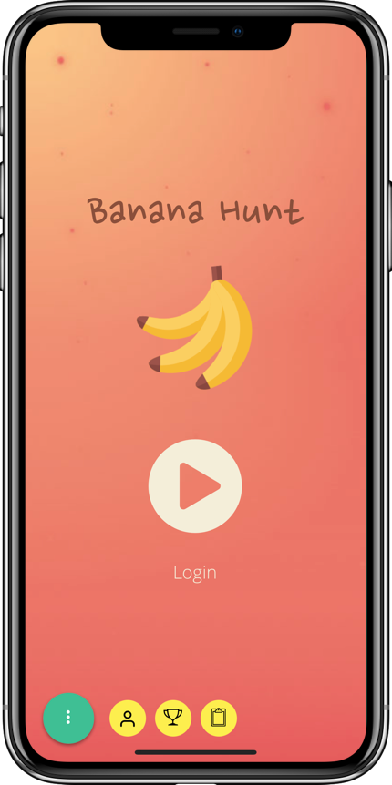
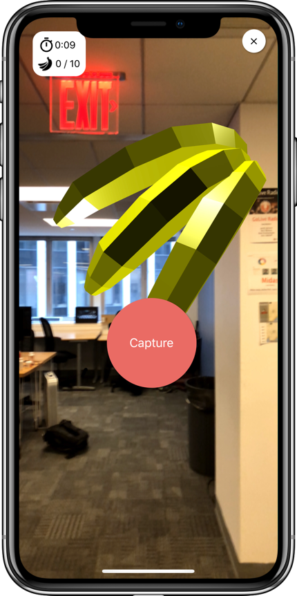

# Welcome to _Banana Hunt_

[Deployed Website](https://bananahuntar.github.io)

[Frontend on EXPO to be deployed]()

[Deployed Backend on Heroku](https://banana-hunt.herokuapp.com)

[Project Github (Frontend & Backend Repositories)](https://github.com/BananaHuntAR)

[Demo Day Presentation - Youtube](https://youtu.be/LcGKAu49MnA)

Banana Hunt is an augmented reality (AR) scavenger hunt that can be played anywhere in the world! On this React-Native iOS mobile app, users can partake in a hunt for AR bananas on an existing map or a randomized map. Logged-in users can even create and share custom maps of their own, whether it be for a park, museum, etc., by pinning their starting location and dropping bananas along their trail!

App features: informative tutorials, login/sign up, user profiles, and top rankings

Game options: quick play, custom play, and create-your-own map

## Screenshots




## Background

* Banana Hunt is built on a Express.js and PostgreSQL back-end, and incorporates experimental technologies on the front-end, including ARKit, Three.js, ExpoTHREE, to provide users with an exciting, interactive, and unique experience.

* Through utilizing both geolocation and relative location data, we've developed functionality that allows users to create custom maps designed for specific locations that can be shared with friends and the rest of the Banana Hunt community.

* This game encourages physical activity, collaboration, and good old fashioned fun. Banana Hunt is sure to includes hours of banana nonsense as you explore your way around the map!

## Running App Locally

This project was bootstrapped with [Create React Native App](https://github.com/react-community/create-react-native-app).

Currently, React Native does not support npm version 5.x+.
We recommend using a Node/NPM version manager like 'n'.
Simply run `npm install -g n` to install 'n' globally.
Running the following commands will tell you what versions you currently have:

```
node -v
npm -v
```

You should see node version v7.7.4 and npm 4.1.2 if you run `sudo n 7.7`.
If you ever want to switch back to the latest version (or you just want to update to the latest version) just run `sudo n latest`.

In the development process, we also recommend using Expo's iOS & Android simulator for quick feedback and testing.

You should only need to update the global installation of `create-react-native-app` very rarely, ideally never.

Updating the `react-native-scripts` dependency of your app should be as simple as bumping the version number in `package.json` and reinstalling your project's dependencies.

## Available Scripts

If Yarn was installed when the project was initialized, then dependencies will have been installed via Yarn, and you should probably use it to run these commands as well. Unlike dependency installation, command running syntax is identical for Yarn and NPM at the time of this writing.

### `npm start`

This script can be used on the backend's and the frontend's separate package.json files to run the app. You can find our server at https://banana-hunt.herokuapp.com.

### `npm test`

Runs the Jest test runner.

## About

Fullstack Academy of Code (Cohort 1802) - Capstone Project

Team I: Andrew Wong, Valerie Pilossof, Frances Wang, Marshall Zobel

Our Instructors: Geoff Bass & Corey Greenwald & Omri Bernstein

Our Team Fellow: Kevin Ho
